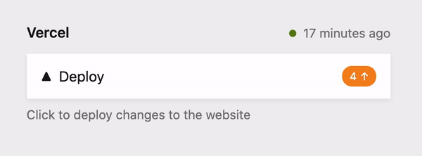

# Kirby Vercel

This is a plugin to trigger [deploy hooks](https://vercel.com/docs/v2/more/deploy-hooks) of a static site with Vercel directly from the Kirby panel.

For it to work, Kirby needs to be set up as a headless CMS on its own server, for example with [KQL](https://github.com/getkirby/kql) or [better-rest](https://github.com/robinscholz/better-rest) to fetch content on your static site generator (e.g. Nuxt, Next, or whichever you prefer) that is then deployed to Vercel via its own repository.

_It does **not** generate a static site of Kirby that is deployed to Vercel directly_



## Installation

### Download

Download and copy this repository to `/site/plugins/kirby-vercel`

### Composer

```
composer require f-mahler/kirby-vercel
```

## Setup

/site/config/config.php

```php
return [
   // Required to make the button work. You can generate a Deployment Hook in Project Settings -> Git Integration in Vercel's Dashboard
  'f-mahler.kirby-vercel.deployurl' => '<deployUrl>',

  // To show the last deployment in the field, you need to add these settings
  'f-mahler.kirby-vercel.token' => '<token>',
  'f-mahler.kirby-vercel.projectid' => '<projectId>',

  // Automatically deploy when triggering one of the following hooks. See Kirby documentation for possible options
  'f-mahler.kirby-vercel.hooks' => [
    'site.update:after',
    'page.update:after'
  ]
];

```

In your blueprint (e.g. /site/blueprints/site.yml)

```
vercel:
  label: Vercel
  type: vercel
```

You can optionally add the following:

```
button: true
deploy: "Publish website"
loading: "Loading.."
complete: "Finished"
error: "Error"
help: "Click to publish changes to the website"
width: 1/3
```

## Alternatives

For Netlify or any other deploy triggers check out: [Kirby-Webhooks](https://github.com/pju-/kirby-webhooks)

## License

MIT

## Credits

- [Frederik Mahler-Andersen](https://github.com/f-mahler)
